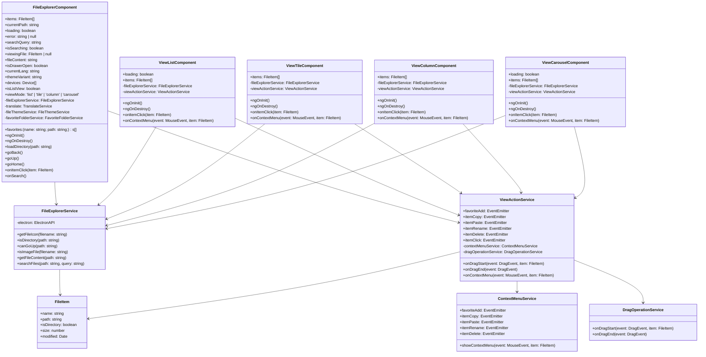

# My Application Builder

A modern desktop application template built with Angular 19 and Electron, providing a foundation for creating cross-platform desktop applications.

## Features

- Modern and responsive user interface using Angular Material
- Cross-platform support (Windows, macOS, Linux)
- Secure file system access through Electron's IPC
- Multi-language support (English/Japanese)
- Development tools integration (ESLint, Prettier)
- TypeScript support
- Hot reloading in development
- Production build optimization
- Icon generation support
- Code formatting and linting

## Prerequisites

- Node.js (v16 or later)
- npm (v7 or later)
- Angular CLI (v19 or later)

## Installation

1. Clone the repository:
```bash
git clone <repository-url>
cd my-application-builder
```

2. Install dependencies:
```bash
npm install
```

## Development

To run the application in development mode:

```bash
npm run electron:serve
```

This will:
1. Start the Angular development server
2. Launch the Electron application
3. Enable hot reloading for development

## Building for Production

To create a production build:

```bash
npm run electron:build
```

This will:
1. Build the Angular application in production mode
2. Package the application with Electron
3. Generate distributable files in the `release` directory

### Build Output

The build process generates the following files:
- `release/mac-arm64/My Application.app` - macOS application bundle
- `release/My Application-0.0.0-arm64.dmg` - macOS DMG installer
- `release/My Application-0.0.0-arm64-mac.zip` - macOS ZIP archive

## Project Structure

```
my-application-builder/
├── src/                    # Angular application source
│   ├── app/               # Application components and services
│   ├── assets/            # Static assets
│   └── styles.css         # Global styles
├── electron/              # Electron main process files
│   ├── main/             # Main process entry point
│   ├── services/         # Electron services
│   ├── handler/          # IPC handlers
│   ├── preload/          # Preload scripts
│   └── constant/         # Constants and configurations
├── scripts/              # Build and utility scripts
├── documents/            # Project documentation
├── .angular/            # Angular build cache
├── .vscode/             # VS Code configuration
├── .idea/               # IntelliJ IDEA configuration
├── dist/                # Angular build output
└── release/             # Electron build output
```

## Development Tools

The project includes several development tools and configurations:

### Code Quality
- ESLint for code linting
- Prettier for code formatting
- TypeScript for type checking

### Available Scripts
- `npm run electron:serve` - Start development server
- `npm run electron:build` - Build for production
- `npm run generate-icons` - Generate application icons
- `npm run lint` - Run ESLint
- `npm run lint:fix` - Fix ESLint issues
- `npm run format` - Format code with Prettier
- `npm run format:check` - Check code formatting

## Configuration Files

- `.eslintrc.json` - ESLint configuration
- `.prettierrc` - Prettier configuration
- `.editorconfig` - Editor configuration
- `tsconfig.json` - TypeScript configuration
- `angular.json` - Angular configuration
- `package.json` - Project dependencies and scripts

## Security

The application implements several security measures:
- Context isolation enabled
- Node integration disabled
- Web security enabled
- Secure IPC communication between main and renderer processes

## License

This project is licensed under the MIT License - see the LICENSE file for details.

## Class Diagram



The class diagram above illustrates the main components and services of the application, along with their relationships. The core components are:

- **FileExplorerComponent**: The main component that orchestrates the file explorer interface
- **View Components**: Different view types (List, Tile, Column, Carousel) for displaying files
- **Services**: Various services handling file operations, drag and drop, and context menu actions
- **FileItem**: The model class representing files and directories

The relationships show how components interact with services and how services depend on each other to provide the full functionality of the file explorer.

## Key Components

1. **FileExplorerComponent**
   - Main UI component handling user interactions
   - Manages file navigation and display
   - Handles language switching and settings

2. **FileExplorerService**
   - Core service for file system operations
   - Communicates with Electron backend
   - Handles file filtering and formatting

3. **FileItem**
   - Data model for file and directory items
   - Contains metadata like name, path, size, etc.

4. **ElectronAPI**
   - Interface for Electron backend communication
   - Handles native file system operations

5. **TranslationService**
   - Manages application translations
   - Supports multiple languages

## Dependencies

- Angular
- Electron
- Angular Material
- @ngx-translate/core
- @ngx-translate/http-loader

## Development

1. Install dependencies:
```bash
npm install
```

2. Run in development mode:
```bash
npm start
```

3. Build for production:
```bash
npm run build
```

## Electron and Angular Application Architecture


The diagram above illustrates the architecture and communication flow between the Angular application and Electron:

1. **Angular Application (Renderer Process)**
   - `FileExplorerComponent`: Main UI component
   - `FileExplorerService`: Core service for file operations
   - `FileThemeService`: Theme management
   - `ViewActionService`: Service for handling view actions
   - `ContextMenuService`: Service for handling context menu actions
   - `DragOperationService`: Service for handling drag operations
   - `ViewTileComponent`: Component for displaying file tiles
   - `ViewListComponent`: Component for displaying file list
   - `ViewCarouselComponent`: Component for displaying file carousel
   - `ElectronAPI`: Interface for Electron communication

2. **Electron Bridge**
   - `preload.js`: Exposes safe IPC methods to renderer
   - `ipcHandlers.js`: Handles IPC communication
   - `main.js`: Main process initialization

3. **Electron Services**
   - `fileExplorerService.js`: File system operations
   - `windowService.js`: Window management
   - `navigationService.js`: Navigation handling
   - `fileSearchService.js`: File search functionality

4. **Native System**
   - File System: Direct file operations
   - System Dialog: Native dialogs
   - System Shell: External application launching

The communication flow:
1. Angular components call methods through the `ElectronAPI` interface
2. Calls are bridged through `preload.js` to the main process
3. `ipcHandlers.js` routes calls to appropriate services
4. Services interact with native system features
5. Results flow back through the same path to the Angular application

## Data Access Sequence

The application follows a well-defined data access sequence for the tile view:

1. Initialization:
   - Component initialization with event listeners
   - Scroll event setup for lazy loading
   - Service subscriptions for actions

2. User Interactions:
   - Item click handling with file type detection
   - Drag and drop operations
   - Context menu display
   - Scroll-based image loading

3. Image Loading:
   - Lazy loading of images based on viewport visibility
   - Image data retrieval through FileExplorerService
   - URL generation and caching
   - Error handling for failed image loads

4. Service Integration:
   - FileExplorerService for file operations
   - ViewActionService for user actions
   - ContextMenuService for menu management
   - DragOperationService for drag and drop

### Tile View Data Access Sequence Diagram


### Tile View and Electron Layer Interaction Sequence


This sequence diagram illustrates the main interactions between the tile view and Electron layer:

1. **Initialization and Directory Loading**
   - Load directory contents on page load
   - Access file system through Electron's IPC
   - Return results to component

2. **Image Loading**
   - Request image data on scroll
   - Load image file through Electron's IPC
   - Return image data to component

3. **Drag Operation**
   - Prepare data on drag start
   - Get drag data through Electron's IPC
   - Start drag operation

4. **Context Menu**
   - Request data when showing context menu
   - Get menu data through Electron's IPC
   - Display context menu

In each step, data follows this path:
1. Angular Component → Service
2. Service → ElectronAPI
3. ElectronAPI → Preload Script
4. Preload Script → IPC Handler
5. IPC Handler → Main Process
6. Main Process → File System
7. Results return through the reverse path

## Screenshots


